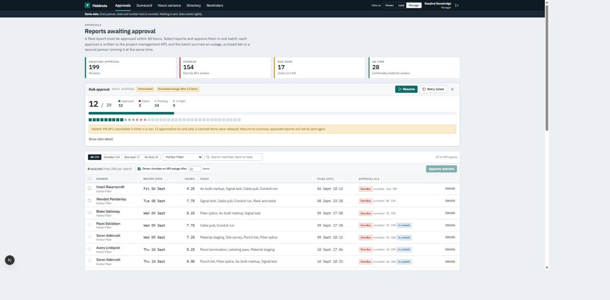
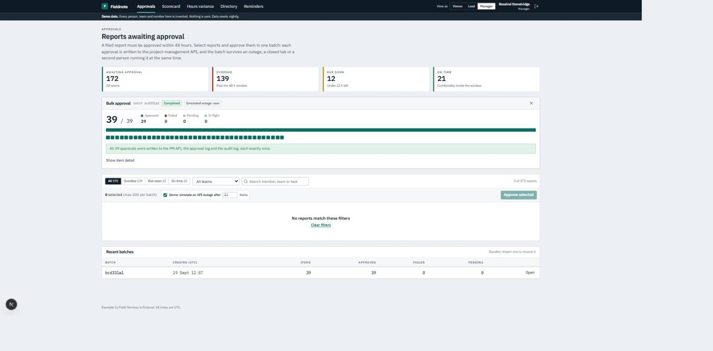
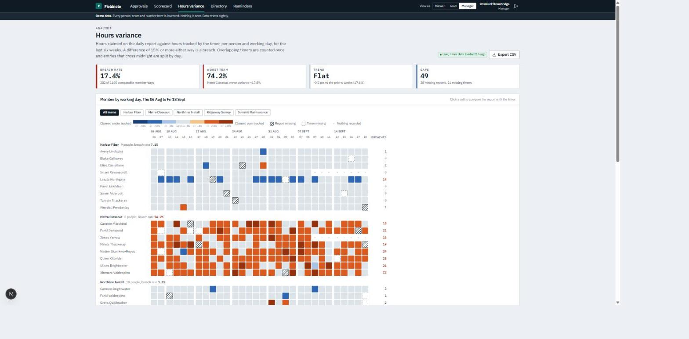
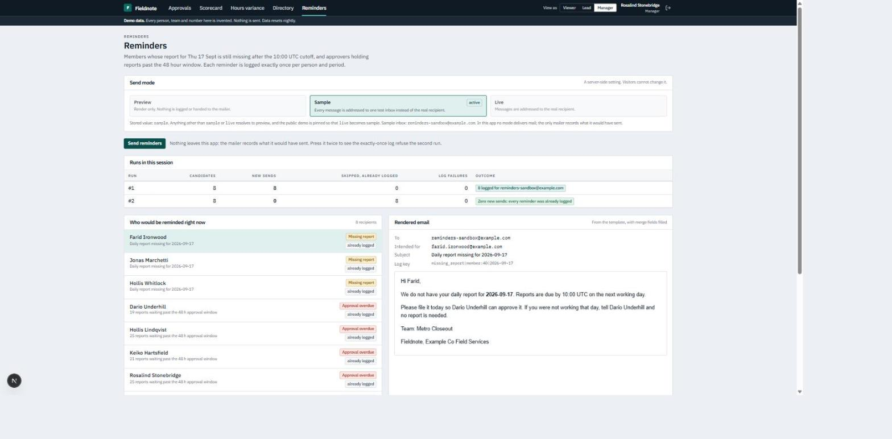
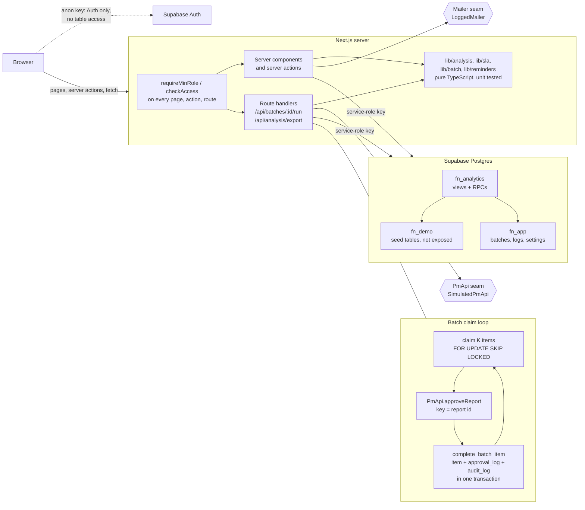

# Fieldnote

Daily-report compliance for field teams. Staff file a report each working day, leads approve them, and managers watch two things: whether reports are filed and approved on time, and whether the hours claimed on a report match the hours a timer actually tracked.

A clean-room portfolio build. It models the kind of workforce-compliance platform I built and run at work, which is private. No code, data or policy from that system is used here; every name and number is invented.

It runs permanently in demo mode on seeded data for a fictional company, Example Co Field Services. Nothing is ever sent, the integrations are simulated, and the data resets nightly.

**Live demo: https://fieldnote-five.vercel.app** (click **Enter demo**; no account needed). Invented data, nothing is sent, resets every night.



| After Resume and Retry failed | Hours variance heatmap | Reminders, run twice |
|---|---|---|
|  |  |  |

Stack: Next.js 16 (App Router, TypeScript strict), React 19, Tailwind CSS 4, Supabase (Postgres + Auth via `@supabase/ssr`), zod, vitest.

## Features tour

### 1. Approval queue with a durable, resumable bulk approve (`/approvals`)

- The queue of reports awaiting approval, scoped to the approver's teams, with an SLA badge (invented rule: approve within 48 hours of filing; "due soon" is the last 12 hours), filters, search, select-all and a detail drawer showing the report's task lines beside that day's timer entries.
- Approving writes to an external project-management API. Here that API is the `PmApi` interface with one implementation, `SimulatedPmApi` (150-400 ms latency, fails on demand, rejects duplicate idempotency keys).
- Bulk approve creates an `approval_batch` row and one `approval_batch_item` row per report. A worker claims items with `FOR UPDATE SKIP LOCKED`, calls the API, and records each outcome. The panel polls once a second and shows every item.
- Tick "Demo: simulate an API outage after N items" before approving. The batch halts, stays in the database as interrupted, and "Resume" / "Retry failed" finish it. Reports that were already approved are never sent again; the simulated API would reject them if they were.
- `/approvals/scorecard`: per approver over 30 days, computed in one SQL function: approved count, median time to approve, share within SLA, current backlog. Sortable, with inline bars.

### 2. Hours variance (`/analysis`)

- A heatmap of members (grouped by team) by working day for the last six weeks. Colour is the variance between claimed and tracked hours on a diverging scale whose steps sit on the invented 8% watch line and 15% breach line. Missing report, missing timer and nothing-recorded are drawn differently from each other and from any colour.
- Click a cell for the member-day: task lines, a timeline of timer entries, and the merged total.
- Box plots of variance per team, summary tiles (breach rate, worst team, trend against the prior six weeks).
- A freshness badge reads `pipeline_runs`. If the last successful load is older than 26 hours the page shows a stale-data banner and does not call itself live.
- "Export CSV" streams the current view from a route handler.

### 3. Directory with role tiers (`/directory`)

- People with team, position, lead, shift, work arrangement and status. A member page shows 30 working days of filing timeliness and a variance sparkline.
- Five tiers: `viewer < lead < manager < hr_staff < admin`. The demo user is a manager. "View as" in the header previews the viewer or lead tier: navigation, page access and team scope all change, the signed-in user does not, and every mutation is refused while previewing. `/policy` needs `hr_staff`, so a visitor can see a tier above their own being refused too.

### 4. Reminders with an exactly-once log (`/reminders`)

- Who would be reminded right now: members whose report is missing after the 10:00 UTC cutoff on the next working day, and approvers holding overdue reports. Each with its rendered email.
- Three modes: `preview`, `sample` (everything addressed to one test inbox), `live`. The mode is a server-side setting, resolved fail-closed (anything unknown is `preview`) and pinned so the demo can never be `live`. The only mailer records what it would have sent.
- Press "Send reminders" twice: the second run reports zero new sends.

## Architecture



## Design decisions

**Durable batches, claimed with SKIP LOCKED, keyed for idempotency.** A bulk approve is rows, not a loop in memory. One worker call processes one chunk: it claims a few pending items through `fn_app.claim_batch_items` (`FOR UPDATE SKIP LOCKED`, stamping `claimed_at` / `claimed_by`), calls the API for each, and records the outcome through `fn_app.complete_batch_item`, which updates the item and writes `approval_log` and `audit_log` in the same transaction. The browser keeps calling until the batch is drained, so each call fits inside a serverless time limit, and a closed tab leaves a batch that anyone can resume. Two runners never get the same item because the second skips locked rows instead of waiting. Claims older than two minutes are treated as abandoned and can be claimed again. The batch's state and totals are derived from its items, never stored, so they cannot disagree. The idempotency key is the report id: if a runner dies after the API accepted an approval but before the outcome was recorded, the retry gets a "duplicate" answer and records success. `approval_log` has the report id as its primary key, so a second approval row is impossible.

**Insert-first, exactly-once reminders.** `reminder_log` has `UNIQUE (kind, subject_key, period)`. The send path does `INSERT ... ON CONFLICT DO NOTHING RETURNING` first, and only the run that got a row back hands the message to the mailer. There is no read-then-write check to race. The trade-off is deliberate: a crash between insert and send loses that one reminder rather than ever sending it twice. A circuit breaker stops the run after three consecutive log-write failures, because sending without a working log would break the guarantee.

**Pure TypeScript analysis, with tests.** Everything in `lib/analysis` takes plain data and returns plain data: variance maths with zero and NULL handled explicitly, overlapping timer entries merged before summing, entries that cross midnight split by day, a working-day calendar (weekends and a holiday list), percentiles and box-plot statistics. SQL returns the raw rows as one JSON document; the loader in `lib/server` is the only part that touches the database.

**One role guard, called everywhere.** `evaluateAccess` is a pure function; `requireMinRole` (pages), `checkAccess` (server actions) and `requireApiRole` (route handlers) all go through it. Every page and every action calls the guard itself; nothing relies on a layout having checked. "View as" can only lower the effective tier, tampered cookie values are ignored, and mutations are refused while a preview is active.

**Service-role-only data access, RLS as a backstop.** The browser never queries a table. Server code uses the service-role client after the guard has run. In the database, RLS is enabled on every table with no policies, nothing is granted to `anon` or `authenticated`, `EXECUTE` is revoked from `public` on every function, and every function pins `search_path = ''`. `fn_demo` is not exposed over the API at all. A leaked anon key reads nothing.

**Fail-closed send mode.** The mode is read from a settings table the app never writes. `resolveSendMode` returns `preview` for anything that is not exactly `sample` or `live`, and the demo pin turns `live` into `sample`.

**Abuse safety for a shared account.** Visitors share one login, so there are no free-text fields that persist, no uploads and no credential settings. The only writes a visitor can cause are batches and approvals, reminder-log rows, audit rows and the view-as cookie. Batch creation is limited to 200 items per batch and 10 batches per 10 minutes, checked in the server action and again inside the SQL function under an advisory lock.

## Run it yourself

1. **Create a Supabase project** (the free tier is enough).
2. **Apply the SQL**, in this order, in the SQL editor: `supabase/schema.sql`, `supabase/seed.sql`, `supabase/reset_demo.sql`. Each is idempotent. All objects live in three new schemas (`fn_app`, `fn_demo`, `fn_analytics`), so the project can be shared with another app.
3. **Expose the schemas**: Project Settings -> API -> Exposed schemas -> add `fn_app` and `fn_analytics`. Do not add `fn_demo`.
4. **Create the demo user**: Authentication -> Users -> Add user, email `demo@example.com`, a password of your choice, "Auto confirm user" on. The seed already contains the matching `fn_app.app_user` row (role `manager`).
5. **Environment**: copy `.env.example` to `.env.local` and fill in `DEMO_MODE=true`, `DEMO_USER_PASSWORD`, `NEXT_PUBLIC_SUPABASE_URL`, `NEXT_PUBLIC_SUPABASE_ANON_KEY`, `SUPABASE_SERVICE_ROLE_KEY`.
6. `npm install`, then `npm run dev`, open http://localhost:3000 and press "Enter demo".
7. **Nightly reset** (optional): enable the `pg_cron` extension and run
   `select cron.schedule('fieldnote-nightly-reset', '10 19 * * *', $$select fn_demo.reset_demo()$$);`
   The seed is relative to the current date, so the reset is also what keeps the demo looking current.

## Deploy to Vercel

Import the repository, keep the Next.js defaults, and set the five variables from step 5 for the Production environment. Do not set `DEMO_AUTH_BYPASS_FOR_LOCAL_TESTS`; it is ignored on Vercel anyway. The Hobby plan is enough: the batch worker does one short chunk per request.

## Tests

| Command | What it covers |
| --- | --- |
| `npm test` | Unit tests for everything in `lib/` with logic: analysis maths, calendar, interval merging and midnight splitting, box-plot stats, heatmap scale, SLA bucketing, role ordering and the guard, the batch state machine, claim / resume / stale-claim logic against an in-memory store, simulated API idempotency, reminder selection, dedupe key, circuit breaker, rate limiter, CSV streaming. |
| `npm run lint`, `npm run typecheck`, `npm run build` | ESLint with `--max-warnings 0`, `tsc --noEmit`, production build. CI runs these plus `npm test` on Node 20. |
| `npm run test:db` | Integration tests: the app's real data layer, batch runner and reminder sender, through the real Supabase client, against the real SQL in a local Postgres 16 + PostgREST. Needs Docker. |
| `npm run db:race` | Two database sessions claim from one batch at once, one of them inside an open transaction, and the script checks the claimed sets are disjoint and stale claims are reclaimable. |
| `npm run test:e2e` | Playwright, against the local stack: outage then resume then retry, drawer, scorecard sort, heatmap drill and CSV download, stale-data banner, reminders twice, directory, View as. |

The local stack:

```bash
docker compose -f docker-compose.local.yml up -d   # Postgres 16 + PostgREST (roles anon / authenticated / service_role, JWT auth)
npm run db:apply                                   # roles, then schema, seed and reset, each applied twice
npm run test:db
npm run db:race

# to click through the app or run the e2e tests against it:
node scripts/local/gateway.mjs                     # maps /rest/v1 to PostgREST so supabase-js works unchanged
# .env.local: NEXT_PUBLIC_SUPABASE_URL=http://127.0.0.1:54331, keys from `node scripts/local/jwt.mjs anon|service_role`,
#             DEMO_MODE=true, DEMO_AUTH_BYPASS_FOR_LOCAL_TESTS=true
npx next dev -p 3107
npm run test:e2e

docker compose -f docker-compose.local.yml down -v
```

That stack has no Auth service, which is what `DEMO_AUTH_BYPASS_FOR_LOCAL_TESTS` is for: it treats every request as `demo@example.com`. It is refused when `NODE_ENV=production` and whenever a Vercel environment variable is present, and both refusals are unit tested. The real "Enter demo" sign-in needs a Supabase project.

## Limits

- One shared demo account. Anything one visitor approves is approved for the next visitor until the nightly reset. If the queue is nearly empty, a manager sees a "Restore the demo queue now" button; the SQL behind it refuses unless fewer than 25 reports are waiting.
- The project-management API and the mailer are simulations behind interfaces. The interfaces are documented for a real implementation (`lib/pm-api/types.ts`, `lib/reminders/send.ts`), but none is included.
- Reminders are at-most-once on delivery: exactly one log row, and a crash between the insert and the send loses that reminder. For nudges that is the right direction to fail.
- The demo company keeps every clock in UTC, so day boundaries, the 10:00 cutoff and midnight splitting are all UTC.
- Light theme only. Laid out for desktop and tablet; the heatmap scrolls sideways on narrow screens.
- `supabase-js` constructs a Realtime client eagerly, which throws on Node 20 because there is no global WebSocket. The app never uses Realtime, so it passes an inert transport (`lib/supabase/no-realtime.ts`) and runs on Node 20 and later.

More screenshots: [`docs/screenshots/`](docs/screenshots/). All are from the running demo, so everything shown is invented.

## License

MIT
